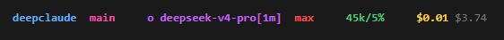

# deepclaude

<!-- AUTO:tagline -->
Provider-agnostic Claude Code wrapper. Route each model slot (Opus, Sonnet, Haiku, subagent) to a different provider. Mix Alibaba, BytePlus, DeepSeek, Fireworks, Groq, Kimi, Mimo, MiniMax, Mistral, Novita, OpenCode, OpenRouter, SiliconFlow, Umans, Z.ai, gm, lo, oa, xa, Anthropic in one session.
<!-- /AUTO:tagline -->

## Architecture

DeepClaude runs a local HTTP routing proxy that intercepts Claude Code's Anthropic API calls and dispatches each model slot (Opus, Sonnet, Haiku, subagent) to a different upstream provider.

**Direct DeepSeek (`ds`) uses the `/anthropic` endpoint** — DeepSeek offers an Anthropic-compatible API surface that speaks Claude's protocol natively. The proxy passes messages through unchanged: no format translation, no content flattening, no lossy conversion. Thinking mode (`{type: "enabled", budget_tokens: N}`), structured content blocks, tool use, and streaming all work without transformation. OpenAI-format translation only activates when routing through third-party providers (OpenRouter, Kimi, Mistral, etc.) that don't offer an Anthropic-compatible endpoint.

**Thinking block echo** — When DeepSeek's thinking mode is enabled, every assistant response that contains a tool_use also includes a `thinking` block. DeepSeek requires these thinking blocks to be echoed back verbatim in every subsequent request — if missing, it returns HTTP 400 ("content[].thinking must be passed back to the API"). The proxy's `thinking-cache.ts` handles this automatically: it extracts thinking blocks from responses, caches them keyed by `sessionKey:toolUseId` (the tool_use UUID is globally unique, so no conversation fingerprint is needed), and re-injects them into the next request before forwarding. **Caches now persist to `~/.deepclaude/thinking-cache/` and survive proxy restarts** — kill+resume no longer burns cache-miss tokens at 120× cost. Same pattern applies to reasoning content via `reasoning-cache.ts` and provider momentum via `momentum.ts`.

### Proxy modules (`proxy/`)

<!-- AUTO:modules -->
| Module | Purpose |
|---|---|
| `canary.ts` | Canary routing state machine (COLD → WARMING → ACTIVE) with configurable rollout percentages and rollback |
| `concurrency.ts` | Promise-queue-based semaphore with FIFO ordering and acquire/release pump pattern |
| `config-lint.ts` | `providers.json` structural validation (used by `--lint-config`) |
| `config.ts` | CLI argument parsing, JSON config loading with mtime-based hot reload, key resolution with AES-256-GCM decryption |
| `crypto.ts` | AES-256-GCM encryption/decryption for provider API keys with async scrypt (N=131072) key derivation and fingerprint-based key caching |
| `dashboard.ts` | Health dashboard HTML page with live SSE metrics stream |
| `dry-run.ts` | Resolved routing table display without starting the proxy (used by `--dry-run`) |
| `encrypt-key.ts` | CLI tool for encrypting API keys |
| `error-codes.ts` | Structured error codes with template interpolation, dev/production mode, credential scrubbing via data-driven pattern list |
| `forward.ts` | Upstream HTTP forwarding with SSE streaming, gzip decompression, stream heartbeat/deadline timers with byte diagnostics, total-byte cap (500MB), fallback header injection, SSE buffer guarding, usage token extraction, peekFirstChunk with fast-stream race protection |
| `friendly-error.ts` | Conversational error responses for exhausted fallback chains |
| `header-sanitizer.ts` | Request header sanitization before logging (drops auth, cookies, noise) |
| `hot-swap-headers.ts` | (undocumented) |
| `launcher.mjs` | Unified Node.js engine shared by deepclaude.ps1, deepclaude.sh, and scripts/cli.mjs — config resolution, routes JSON, env vars with [1m] suffix and compaction window, slot/thinking overrides, proxy state, pricing/model/key data. Zero npm deps, single source of truth. |
| `log.ts` | Structured logger with per-module namespacing, request IDs, and env-gated debug level (`DEEPCLAUDE_DEBUG=true`) |
| `lru-cache.ts` | TTL cache with LRU eviction using delete-then-set MRU promotion and lazy shared cleanup |
| `model-trust.ts` | (undocumented) |
| `momentum.ts` | Session-based provider stickiness (tracks last 5 provider decisions) |
| `notify.ts` | (undocumented) |
| `pre-exec-validate.ts` | (undocumented) |
| `probe.ts` | Single-provider health probe with auth failure detection and latency measurement |
| `prompt-router.ts` | Request prompt complexity classification (TRIVIAL/CHAT/CODE/TOOL/HEAVY) for cost-based routing |
| `protocol-translate.ts` | Bidirectional Anthropic Messages ↔ OpenAI Chat Completions format translation (only active for OpenAI-format providers — `ds` bypasses this entirely via DeepSeek's `/anthropic` endpoint) |
| `protocol-types.ts` | (undocumented) |
| `rate-limiter.ts` | Per-IP fixed-window rate limiter with LRU eviction |
| `reasoning-cache.ts` | OpenAI-format reasoning content cache with session-keyed LRU and re-injection — same UUID-keyed architecture as thinking-cache.ts, no conversation fingerprint (only for OpenAI-format providers; `ds` handles this natively) |
| `request-log.ts` | Opt-in request logging to `~/.deepclaude/requests.log` (`--log-all` or `DEEPCLAUDE_LOG_ALL_REQUESTS=true`) |
| `routing.ts` | Slot-based routing with prefix matching, fallback chain construction, circuit breaker |
| `server-tools.ts` | Anthropic server tool conversion (web_search, web_fetch, url_fetch, computer, bash, text_editor, memory, tool_search_tool), DuckDuckGo web search, SSRF-protected web fetch, tool result population |
| `session-key.ts` | SHA-256 session key derivation from conversation content, shared by thinking/reasoning caches and momentum |
| `ssrf.ts` | URL validation against SSRF/DNS rebinding, blocks private/internal IPs and metadata endpoints |
| `start-proxy.ts` | Entry point — HTTP server, request lifecycle, health endpoint |
| `startup-check.ts` | Startup health probe — concurrent non-streaming + streaming checks per provider before accepting connections |
| `stats.ts` | Provider health tracking, circuit breaker with 429 exclusion, auto-probe recovery with cooldown backoff, request statistics, token/spend tracking with atomic writes and restart persistence, event loop lag monitoring, provider stats reconciliation on config reload |
| `stream-metrics.ts` | Per-stream timing (TTFB, tokens/sec) and aggregated provider metrics |
| `thinking-cache.ts` | Anthropic-format thinking block extraction, caching, and injection for multi-turn tool conversations — keyed on sessionKey:toolUseId (no conversation fingerprint) to avoid cross-turn cache misses with DeepSeek thinking mode |
| `thinking-config.ts` | (undocumented) |
| `transport-errors.ts` | Network failure classification via ordered signature tuples with cause chain walking |
| `truncate.ts` | Log/error body length truncation with credential scrubbing |
| `util.ts` | Path deduplication for /v1-prefixed providers, safe header construction |
<!-- /AUTO:modules -->

### Data-driven provider registry

The proxy and CLI read from `proxy/providers.json`. The launcher (`proxy/launcher.mjs`) generates `~/.deepclaude/current-routes.json` from it, which the proxy and `statusline.mjs` load at runtime. Config resolution, route construction, and context-limit lookups are centralized in `proxy/launcher.mjs` — a zero-dependency Node.js module shared by `deepclaude.ps1`, `deepclaude.sh`, and `scripts/cli.mjs`. This eliminates duplicated provider, config, and context-limit definitions across languages and guarantees behavioral parity.

<!-- AUTO:providers-schema -->
```
providers.json
├── providers          →  endpoint, auth, wire format, fallbacks, setup URLs, streamUsageReporting, extraHeaders
├── aliases            →  short model aliases (e.g. "v4" → "deepseek-v4-pro")
├── contextLimits      →  per-model token windows
├── thinking           →  per-model reasoning mode config (type, budget_tokens)
├── compactionWindow   →  per-model compaction thresholds (950K for DeepSeek — preserves disk cache hits)
├── configs            →  named preset configs (slot → provider:model), monthlyBudget
└── pricing            →  per-model input/output/cache token pricing ($/MTok)
```
<!-- /AUTO:providers-schema -->

### Launcher scripts

**`scripts/cli.mjs`** is the single entry point (Node.js) — handles all flag parsing, config resolution, proxy launch, and CC spawn. All subcommands (`--status`, `--models`, `--cost`, `--doctor`, `--dry-run`, etc.) are dispatched from here.

- **`deepclaude.ps1`** — 15-line PowerShell wrapper, just resolves Node.js and invokes `node scripts/cli.mjs @args`
- **`deepclaude.sh`** — 10-line Bash wrapper, `exec node scripts/cli.mjs "$@"`

Config resolution, routes JSON construction, env var computation, slot/thinking overrides, and context window calculation live in **`proxy/launcher.mjs`** — a zero-dependency Node.js module shared across all entry points. This eliminates the ~1800 lines of duplicated PS1/SH logic and guarantees behavioral parity across platforms.

### Test coverage

<!-- AUTO:test-coverage -->
1714 tests across 52 test files covering all proxy modules — transport errors, concurrency, LRU cache, provider registry validation, error codes, routing, stats, forwarding, server tools, config, protocol translation, thinking cache (including fingerprint-free cross-turn regression tests), reasoning cache, header sanitization, truncation, crypto, friendly errors, SSRF validation, dead stream detection, startup checks, and stream metrics. Run with `npm test`.
<!-- /AUTO:test-coverage -->

### Pre-commit

Husky v9 + lint-staged: syntax check on staged files, TypeScript compilation guard.

### Web Search

DeepClaude intercepts web search requests BEFORE they reach any model provider. Claude Code's WebSearch harness sends `web_search_20250305` tool requests — the proxy runs DuckDuckGo locally and returns results inline, bypassing the model entirely.

```
CC sends: {tools: [{type: "web_search_20250305"}], messages: [{text: "Perform a web search for the query: ..."}]}
    ↓
Proxy intercepts (before routing) → extracts query → searches DDG
    ↓
Returns Anthropic-native web_search_tool_result with:
  - Proper content blocks CC counts for "Did N searches"
  - server_tool_use.web_search_requests in usage
  - claude-* trusted model name
```

**Why this matters**: Non-Anthropic providers (DeepSeek, OpenAI) don't execute web searches server-side. They'd only return `tool_use` blocks — CC would show "Did 0 searches." Pre-execution makes web search work identically across all 18 providers.

**Five-layer defense against regressions**:
1. Type system (`protocol-types.ts`) — `web_search_tool_result`, `caller`, `web_search_result` types
2. Response validator (`pre-exec-validate.ts`) — checks ALL required fields before sending (both stream + non-stream)
3. Integration tests — exact format assertions against real proxy
4. Unit tests — 25 validation test cases
5. Search-debug skill (`/search-debug`) — live diagnostics

See [[web-search-tool-result-format]] and [[web-search-guardrails]] for the exact protocol format.

## Quick start

```
# Get a DeepSeek API key: https://platform.deepseek.com

setx DEEPSEEK_API_KEY "sk-your-key"          # Windows
export DEEPSEEK_API_KEY="sk-your-key"        # macOS/Linux

# Option 1: npm link (creates global deepclaude command)
npm install -g .

# Option 2: Add repo directory to PATH manually
# Windows: setx PATH "%PATH%;C:\path\to\deepclaude"
# macOS/Linux: export PATH="$PATH:/path/to/deepclaude"

deepclaude                                    # Launch with DeepSeek V4 Pro
dc                                            # Shortcut — same as deepclaude (Windows: dc.cmd, macOS/Linux: alias)
```

## Requirements

- **Windows:** PowerShell 7+ ([download](https://github.com/PowerShell/PowerShell))
- **macOS/Linux:** bash 4+, jq, netcat (nc), Node.js 18+
- Node.js 18+ (for the proxy)

## Scripts

```
npm run verify          # Full verification: tests + lint
npm run restart-proxy   # Hot-swap to a new proxy (old forwards, dies when drained)
npm run build:readme    # Regenerate README.md from template
npm test               # Run test suite
```

## Usage

### Named configs (`-b`)

```
<!-- AUTO:named-configs -->
deepclaude                  # ds (default) — DeepSeek V4 Pro
deepclaude -b bp              # BytePlus Doubao 1.5 Pro
deepclaude -b ds+an           # DeepSeek + Anthropic Haiku
deepclaude -b ds+oc           # DeepSeek + OpenCode subs
deepclaude -b fw              # Fireworks AI
deepclaude -b gr              # Groq (Llama 4 Maverick)
deepclaude -b km              # Kimi K2.6
deepclaude -b mx              # MiniMax M1
deepclaude -b mt              # Mistral Large
deepclaude -b nv              # Novita (DeepSeek V4 Pro)
deepclaude -b lo              # Ollama (local)
deepclaude -b oa              # OpenAI (direct)
deepclaude -b oc              # OpenCode Zen
deepclaude -b or              # OpenRouter (DeepSeek)
deepclaude -b sf              # SiliconFlow (DeepSeek V4 Pro)
deepclaude -b um              # Umans Coder (Kimi K2.6)
deepclaude -b xa              # xAI / Grok
deepclaude -b mm              # Xiaomi Mimo V2.5 Pro
deepclaude -b za              # Z.ai GLM 4.5
deepclaude -b anthropic     # Normal Claude Code
<!-- /AUTO:named-configs -->
```

### Ad-hoc positional configs

Pass 1–5 `providerKey:modelId` specs. Each spec is assigned to consecutive slots:

| Specs | Opus | Sonnet | Haiku | Subagent | Fable |
|-------|------|--------|-------|----------|-------|
| 1 spec | spec 1 | spec 1 | spec 1 | spec 1 | spec 1 |
| 2 specs | spec 1 | spec 1 | spec 1 | spec 2 | spec 2 |
| 3 specs | spec 1 | spec 2 | spec 2 | spec 2 | spec 3 |
| 4 specs | spec 1 | spec 2 | spec 3 | spec 4 | spec 4 |
| 5 specs | spec 1 | spec 2 | spec 3 | spec 4 | spec 5 |

Slot order: opus, sonnet, haiku, subagent, fable. When you provide fewer specs than slots, the last spec fills all remaining slots.

```
deepclaude ds:deepseek-v4-pro                                              # 1 spec → all 5 slots
deepclaude ds:deepseek-v4-pro oc:big-pickle                                # 2 specs → opus/sonnet/haiku=ds, sub/fable=oc
deepclaude ds:deepseek-v4-pro oc:big-pickle or:z-ai/glm-4.5-air:free       # 3 specs → opus=ds, sonnet/haiku/sub=oc, fable=or
deepclaude ds:deepseek-v4-pro ds:deepseek-v4-pro oc:big-pickle or:z-ai/glm-4.5-air:free  # 4 specs → sub/fable share last
deepclaude ds:deepseek-v4-pro ds:deepseek-v4-pro oc:big-pickle or:z-ai/glm-4.5-air:free mm:mimo-v2.5-pro  # 5 specs → direct 1:1
```

### Flags

```
<!-- AUTO:flags -->
-h, --help      Show this help
--status        Show keys, configs, and active slot mapping
--doctor        System health check (prereqs, keys, proxy test)
--cost          Pricing comparison
--benchmark     Latency test across all configs (parallel via background jobs)
--models        List all available model IDs (for /model in CC)
--remote        Browser-based remote control (starts proxy automatically)
--set-slot SLOT MODEL  Override a slot (opus/sonnet/haiku/subagent/fable)
--subagent-model MODEL  Set a dedicated subagent model (e.g., oc:big-pickle)
--probe [FILE]  Test each provider with a minimal prompt (latency, tokens, auth)
--dry-run [FILE] Show resolved routing table without starting the proxy
--what-if       Alias for --dry-run
--dashboard     Print health dashboard URL (http://127.0.0.1:PORT/dashboard)
--open          Open dashboard in browser (use with --dashboard)
--version       Print version with git hash and proxy path
--lint          Self-lint (PSScriptAnalyzer on .ps1, shellcheck on .sh)
--lint-config   Validate providers.json configuration
--effort LEVEL  Set Claude Code effort level (default: max). Values: low, medium, high, max.
--fix-av        Print Windows Defender exclusion commands
--install-statusline  Install status bar showing model, effort, context (requires restart)
--logs, --tail  Tail the proxy log (~/.deepclaude/proxy.log)
--health        Quick health check (one-line summary)
--log-all       Log all requests to ~/.deepclaude/requests.log (by default only failures are logged)
--stats         Show proxy request stats and provider health
--skip-startup-check  Skip provider health checks on proxy startup
--no-thinking   Disable extended thinking for all models (save cost)
--thinking-budget N  Set thinking budget in tokens (e.g. 64000 for deep reasoning)
<!-- /AUTO:flags -->
```

## Providers and API keys

<!-- AUTO:providers-table -->
| Key | Provider | Flag | Auth |
|---|---|---|---|
| `DEEPSEEK_API_KEY` | DeepSeek (direct) | `ds` | x-api-key |
| `OPENROUTER_API_KEY` | OpenRouter | `or` | bearer |
| `FIREWORKS_API_KEY` | Fireworks AI | `fw` | bearer |
| `OPENCODE_API_KEY` | OpenCode Zen | `oc` | bearer |
| `ALIBABA_DASHSCOPE_API_KEY` | Alibaba/DashScope | `al` | bearer |
| `KIMI_API_KEY` | Kimi/Moonshot | `km` | bearer |
| `MIMO_API_KEY` | Xiaomi Mimo | `mm` | bearer |
| `UMANS_API_KEY` | Umans AI | `um` | x-api-key |
| `GROQ_API_KEY` | Groq | `gr` | bearer |
| `MISTRAL_API_KEY` | Mistral | `mt` | bearer |
| `MINIMAX_API_KEY` | MiniMax | `mx` | bearer |
| `ZAI_API_KEY` | Z.ai / GLM | `za` | bearer |
| `BYTEPLUS_API_KEY` | BytePlus/Doubao | `bp` | bearer |
| `SILICONFLOW_API_KEY` | SiliconFlow | `sf` | bearer |
| `NOVITA_API_KEY` | Novita | `nv` | bearer |
| `OPENAI_API_KEY` | OpenAI (direct) | `oa` | bearer |
| `XAI_API_KEY` | xAI / Grok | `xa` | bearer |
| `GEMINI_API_KEY` | Google Gemini | `gm` | x-api-key |
| `ANTHROPIC_API_KEY` | Anthropic (direct) | `an` | x-api-key |
| `` | Ollama (local) | `lo` | x-api-key |
<!-- /AUTO:providers-table -->

Keys are read from both process env and machine/user environment variables.

<!-- AUTO:openai-note -->
Providers with `format = "openai"` (OpenRouter, Alibaba/DashScope, Kimi/Moonshot, Xiaomi Mimo, Groq, Mistral, MiniMax, Z.ai / GLM, BytePlus/Doubao, SiliconFlow, Novita, oa, xa, lo) use OpenAI-compatible endpoints. The proxy automatically translates between Anthropic and OpenAI protocols — including thinking/reasoning, tool calls, streaming, and multi-turn context management. Direct DeepSeek (`ds`) uses the `/anthropic` endpoint and bypasses all translation.
<!-- /AUTO:openai-note -->

## Provider fallback

Providers can specify a `fallback` list — if the primary provider fails (500, 429, timeout, dead stream), the proxy automatically retries with the fallback:

```
<!-- AUTO:fallback-list -->
ds → fallback: oc, um                    # DeepSeek (direct) fails → oc/um
oc → fallback: um                        # OpenCode Zen fails → um
al → fallback: ds                        # Alibaba/DashScope fails → ds
km → fallback: ds                        # Kimi/Moonshot fails → ds
mm → fallback: oc                        # Xiaomi Mimo fails → oc
um → fallback: or                        # Umans AI fails → or
gr → fallback: ds                        # Groq fails → ds
mt → fallback: ds                        # Mistral fails → ds
mx → fallback: ds                        # MiniMax fails → ds
za → fallback: ds                        # Z.ai / GLM fails → ds
bp → fallback: ds                        # BytePlus/Doubao fails → ds
sf → fallback: ds                        # SiliconFlow fails → ds
nv → fallback: ds                        # Novita fails → ds
xa → fallback: ds                        # xAI / Grok fails → ds
<!-- /AUTO:fallback-list -->
```

Fallbacks are configured per-provider and transparent to Claude Code. Max 3 attempts per request.

## Named configs reference

```
<!-- AUTO:configs-reference -->
or      opus=or:deepseek/deepseek-v4-pro  sonnet=or:deepseek/deepseek-v4-pro  haiku=or:deepseek/deepseek-v4-flash  sub=or:deepseek/deepseek-v4-flash  fable=or:deepseek/deepseek-v4-pro
fw      opus=fw:accounts/fireworks/models/deepseek-v4-pro  sonnet=fw:accounts/fireworks/models/deepseek-v4-pro  haiku=fw:accounts/fireworks/models/deepseek-v4-pro  sub=fw:accounts/fireworks/models/deepseek-v4-pro  fable=fw:accounts/fireworks/models/deepseek-v4-pro  (all slots same)
oc      opus=oc:big-pickle  sonnet=oc:big-pickle  haiku=oc:big-pickle  sub=oc:big-pickle  fable=oc:big-pickle  (all slots same)
km      opus=km:kimi-k2.6  sonnet=km:kimi-k2.6  haiku=km:kimi-k2.6  sub=km:kimi-k2.6  fable=km:kimi-k2.6  (all slots same)
mm      opus=mm:mimo-v2.5-pro  sonnet=mm:mimo-v2.5-pro  haiku=mm:mimo-v2.5-pro  sub=mm:mimo-v2.5-pro  fable=mm:mimo-v2.5-pro  (all slots same)
um      opus=um:umans-coder  sonnet=um:umans-coder  haiku=um:umans-coder  sub=um:umans-coder  fable=um:umans-coder  (all slots same)
gr      opus=gr:groq/llama-4-maverick  sonnet=gr:groq/llama-4-maverick  haiku=gr:groq/deepseek-r1-distill-qwen-32b  sub=gr:groq/deepseek-r1-distill-qwen-32b  fable=gr:groq/llama-4-maverick
mt      opus=mt:mistral/mistral-large  sonnet=mt:mistral/mistral-large  haiku=mt:mistral/mistral-small  sub=mt:mistral/mistral-small  fable=mt:mistral/mistral-large
mx      opus=mx:minimax/minimax-m1  sonnet=mx:minimax/minimax-m1  haiku=mx:minimax/minimax-m1  sub=mx:minimax/minimax-m1  fable=mx:minimax/minimax-m1  (all slots same)
za      opus=za:zai/glm-4.5  sonnet=za:zai/glm-4.5  haiku=za:zai/glm-4.5  sub=za:zai/glm-4.5  fable=za:zai/glm-4.5  (all slots same)
bp      opus=bp:byteplus/doubao-1.5-pro  sonnet=bp:byteplus/doubao-1.5-pro  haiku=bp:byteplus/doubao-1.5-pro  sub=bp:byteplus/doubao-1.5-pro  fable=bp:byteplus/doubao-1.5-pro  (all slots same)
sf      opus=sf:siliconflow/deepseek-v4-pro  sonnet=sf:siliconflow/deepseek-v4-pro  haiku=sf:siliconflow/deepseek-v4-pro  sub=sf:siliconflow/deepseek-v4-pro  fable=sf:siliconflow/deepseek-v4-pro  (all slots same)
nv      opus=nv:novita/deepseek-v4-pro  sonnet=nv:novita/deepseek-v4-pro  haiku=nv:novita/deepseek-v4-pro  sub=nv:novita/deepseek-v4-pro  fable=nv:novita/deepseek-v4-pro  (all slots same)
oa      opus=oa:gpt-5  sonnet=oa:gpt-5  haiku=oa:gpt-5-mini  sub=oa:gpt-5-mini  fable=oa:gpt-5
xa      opus=xa:grok-4  sonnet=xa:grok-4  haiku=xa:grok-code-fast  sub=xa:grok-code-fast  fable=xa:grok-4
lo      opus=lo:ollama/llama3.3  sonnet=lo:ollama/llama3.3  haiku=lo:ollama/qwen3  sub=lo:ollama/qwen3  fable=lo:ollama/llama3.3
ds+oc   opus=ds:deepseek-v4-pro  sonnet=ds:deepseek-v4-pro  haiku=oc:big-pickle  sub=oc:big-pickle  fable=ds:deepseek-v4-pro
ds+an   opus=ds:deepseek-v4-pro  sonnet=ds:deepseek-v4-pro  haiku=an:claude-haiku-4-5-20251001  sub=an:claude-haiku-4-5-20251001  fable=ds:deepseek-v4-pro
<!-- /AUTO:configs-reference -->
```

Note: `al` (Alibaba/DashScope) is only available via ad-hoc config and fallback, not as a named `-b al` config.

## Slot overrides (`--set-slot`)

Override individual model slots without changing configs. Survives config switches.

```
deepclaude --set-slot haiku or:z-ai/glm-4.5-air:free   # Set haiku to a free OR model
deepclaude --set-slot subagent oc:big-pickle            # Set subagent to OpenCode
deepclaude --set-slot sonnet                            # Clear override (reverts to config default)
```

Overrides are stored in `~/.deepclaude/slot-overrides.json`. The proxy reloads them on every request — changes take effect immediately in a running session.

Within Claude Code, you can switch the **opus** model directly:
```
/model oc:big-pickle               # Switch opus to OpenCode
/model or:z-ai/glm-4.5-air:free    # Switch opus to a free OR model
```

## Context window limits

Per-model context limits are configured automatically:

<!-- AUTO:context-table -->
| Model | Context |
|---|---|
| `gemini-2.5-pro` | 1M |
| `deepseek-v4-pro`, `deepseek-v4-flash`, `deepseek/deepseek-v4-pro`, `deepseek/deepseek-v4-flash`, `accounts/fireworks/models/deepseek-v4-pro`, `siliconflow/deepseek-v4-pro`, `novita/deepseek-v4-pro`, `gemini-2.5-flash`, `gemini-3.0-flash` | 1M |
| `kimi-k2.6`, `umans-kimi-k2.6`, `umans-coder`, `minimax/minimax-m1` | 256K |
| `o4`, `o4-mini`, `claude-haiku-4-5-20251001`, `claude-sonnet-4-6`, `claude-opus-4-7` | 195K |
| `z-ai/glm-4.5-air:free`, `big-pickle`, `mimo-v2.5-pro`, `umans-flash`, `umans-glm-5.1`, `groq/llama-4-maverick`, `groq/deepseek-r1-distill-qwen-32b`, `mistral/mistral-large`, `mistral/mistral-small`, `zai/glm-4.5`, `byteplus/doubao-1.5-pro`, `gpt-5`, `gpt-5-mini`, `grok-4`, `grok-3`, `grok-code-fast`, `ollama/llama3.3`, `ollama/qwen3`, `ollama/deepseek-r1` | 128K |
<!-- /AUTO:context-table -->

Models at 1M tokens get `CLAUDE_CODE_AUTO_COMPACT_WINDOW` set (clamped to 1,000,000 — Claude Code's internal max). Models between 128K–1M get `CLAUDE_CODE_MAX_CONTEXT_TOKENS` with compaction disabled. A `[1m]` suffix is appended to 1M-context model IDs (e.g. `deepseek-v4-pro[1m]`) — this is stripped by the proxy's router and used internally by Claude Code for dynamic context-window detection.

DeepSeek V4 models use a `compactionWindow` of 950K tokens to preserve automatic disk cache hits. Compaction rewrites conversation history, which invalidates the prefix and forces an expensive cache miss ($0.435/M). By delaying compaction to 950K (near the 1M wall), most requests stay within the same prefix and hit the disk cache at $0.0036/M — a 120× discount. The cache persists for hours to days and requires no configuration.

### Cost optimization (defaults)

The default config is **`ds+oc`** (DeepSeek for opus/sonnet/fable, free OpenCode for haiku/subagent). Prompt-router sends TRIVIAL requests (greetings, `<50` char) to free providers automatically. A **$25/day budget cap** is on by default — set `DEEPCLAUDE_DAILY_BUDGET=0` to disable. Provider fallback chains prefer free tiers: `ds → oc → um → or`.

## Per-session proxy design

Each `deepclaude` invocation starts its own isolated proxy on a unique port. The proxy lives only as long as the CC session — when CC exits, the proxy is killed. There is no shared proxy, no PID lock, and no `--persist`/`--switch`/`--stop-proxy` flags.

**Hot-swap:** To restart the proxy mid-session, write the new port to `~/.deepclaude/next-proxy.port`, start a new proxy on that port (detached, with `--port <N>`), and the old proxy detects the signal and enters forwarding mode. It forwards all traffic to the new proxy and exits when all client connections drain. Then restart CC to pick up the new proxy.

```
deepclaude                                    # Starts isolated proxy on a random port

# Mid-session slot/model changes (use in CC):
/model oc:big-pickle                         # Switch opus to OpenCode
/model or:z-ai/glm-4.5-air:free              # Switch opus to a free OR model

deepclaude --set-slot haiku oc:big-pickle    # Change just the haiku slot (from another terminal)
deepclaude --models                          # List all available models
```

State files live in `~/.deepclaude/`:
<!-- AUTO:state-files -->
- `proxy.port` — port number of most recently started proxy (diagnostics)
- `current-routes.json` — active routing table (reloaded on every request)
- `slot-overrides.json` — per-slot model overrides
- `thinking-overrides.json` — thinking mode overrides (--no-thinking / --thinking-budget)
- `spend.json` — daily and total spend tracking (atomic write via .tmp + rename)
- `subagent-model.json` — dedicated subagent model setting
- `fix-av.cmd` — standalone AV exclusion script (survives Defender quarantine of proxy files)
- `requests.log` — opt-in request logs (JSONL, timestamped rotation, 5 backups)
<!-- /AUTO:state-files -->

## Remote control (`--remote`)

```
deepclaude --remote                 # Default config via proxy
deepclaude --remote -b ds+oc        # Named config
deepclaude --remote ds:deepseek-v4-pro oc:big-pickle  # Ad-hoc
deepclaude --remote -b anthropic    # Anthropic direct
```

Starts the routing proxy, prints a `claude.ai/code/session_...` URL. Works on phone, tablet, any browser. Proxy auto-stops on exit.

## Doctor

System health check — verifies Node.js, proxy script, state directory, API keys, slot overrides, and runs a proxy startup test:

```
deepclaude --doctor
```

## Statusline

Shows the real model, provider, context usage, effort level, and git branch — with slot override resolution so you see what's actually running.



| Color | Element | Source |
|---|---|---|
| `#64B4FF` Light blue | Directory name | `d.workspace.current_dir` last segment |
| `#FF50B4` Pink | Git branch | `git rev-parse --abbrev-ref HEAD` |
| `#C864FF` Purple | Slot + model | Slot label (`o`/`s`/`h`/`sub`/`f`) + resolved model ID |
| `#FF5050` Red / `#FFB432` Orange / `#64A0FF` Blue | Effort | `max`/`high` (red), `medium` (orange), `low` (blue) |
| `#50C878` Green / `#FFB432` Orange / `#FF5050` Red | Context usage | Token count + percent — green ≤50%, orange 50–79%, red ≥80% |
| `#FFD250` Gold | Session spend | Current Claude Code session cost from `~/.deepclaude/spend.json` |
| `#787878` Gray | Today spend | Daily total (shown when it exceeds session spend) |

The context gauge shows `tokens/percent` (e.g. `45k/5%` when the max is known). DeepSeek V4 Pro appends milestone tags: **SR** (300K+, purple) and **FBR** (400K+, magenta). Circuit breakers show **✕** (open, red), **◐** (half-open, orange), or **·** (closed, green). A recent fallback appends **↳**provider (orange).

```
# All platforms (Node.js)
1. Copy statusline/statusline.mjs → ~/.claude/statusline.mjs
2. Add to ~/.claude/settings.json:

  { "statusLine": { "type": "command", "command": "node ~/.claude/statusline.mjs" } }
```

Resolves slot overrides from `~/.deepclaude/slot-overrides.json` and context limits from `~/.deepclaude/current-routes.json`, so the token gauge and model display always reflect reality.

Tip: `deepclaude --install-statusline` automates the manual setup above.

## Environment

<!-- AUTO:env-vars -->
| Variable | Purpose |
|---|---|
| `DEEPCLAUDE_BRAVE_API_KEY` | (undocumented) |
| `DEEPCLAUDE_BUDGET_WARNING` | Fraction of daily budget at which to emit warnings (default: unset) |
| `DEEPCLAUDE_CONFIG_DIR` | (undocumented) |
| `DEEPCLAUDE_DAILY_BUDGET` | Daily spending cap in dollars (proxy rejects requests when exceeded) |
| `DEEPCLAUDE_DASHBOARD_KEY` | Shared secret for `/dashboard` and `/health/stream` endpoints (unset = no auth) |
| `DEEPCLAUDE_DEBUG` | Enable debug-level log output (`true`, `1`, or `yes`, case-insensitive) |
| `DEEPCLAUDE_DEFAULT_BACKEND` | Default config name (falls back to `ds`; legacy `CHEAPCLAUDE_DEFAULT_BACKEND` also accepted) |
| `DEEPCLAUDE_DEV` | Development mode — more verbose error details in responses (`1` or `true`) |
| `DEEPCLAUDE_DIR` | (undocumented) |
| `DEEPCLAUDE_DRAIN_GRACE_MS` | (undocumented) |
| `DEEPCLAUDE_ENCRYPTION_KEY` | Master key for AES-256-GCM API key decryption (used with `--encrypt-key`) |
| `DEEPCLAUDE_LOG_ALL_REQUESTS` | Log all requests to `~/.deepclaude/requests.log` (`true` to enable) |
| `DEEPCLAUDE_LOG_LEVEL` | Set log level (`debug` for verbose output; defaults to `info`) |
| `DEEPCLAUDE_MAX_CONCURRENT` | Max concurrent upstream requests for main slots (default: `25`) |
| `DEEPCLAUDE_SEARCH_ENGINES` | (undocumented) |
| `DEEPCLAUDE_SEARCH_NO_NETWORK` | (undocumented) |
| `DEEPCLAUDE_SEARXNG_URL` | (undocumented) |
| `DEEPCLAUDE_SKIP_STARTUP_CHECK` | Skip provider health checks on proxy startup (`true` to skip) |
| `DEEPCLAUDE_STREAM_DEADLINE_MS` | Hard wall-clock cap on total streaming duration in ms (default: `300000`) |
| `DEEPCLAUDE_STREAM_HEARTBEAT_MS` | Stream silence timeout in ms before heartbeat triggers (default: `180000`) |
| `DEEPCLAUDE_SUBAGENT_MAX_CONCURRENT` | Max concurrent upstream requests for subagent slots (default: `8`) |
| `DEEPCLAUDE_SUBAGENT_STREAM_DEADLINE_MS` | Hard wall-clock cap on subagent streaming duration in ms (default: `90000`) |
| `DEEPCLAUDE_SUBAGENT_STREAM_HEARTBEAT_MS` | Subagent stream heartbeat timeout in ms (default: `90000`) |
<!-- /AUTO:env-vars -->

All provider API key env vars (see [Providers table](#providers-and-api-keys)) are pushed into the process so the proxy (child process) inherits them.

## Windows Defender

The proxy starts a local HTTP server and forwards requests — Windows Defender often flags this as suspicious behavior and may **delete or quarantine** the proxy files. This is a catch-22: if deepclaude is deleted, you can't run `deepclaude --fix-av`.

**deepclaude writes a standalone rescue script on every launch:** `~/.deepclaude/fix-av.cmd`. Even if AV deletes the entire deepclaude directory, this file survives (it lives in your home directory, not near any executables). Run it as **administrator**:

```
~/.deepclaude/fix-av.cmd
```

Alternatively, run these commands manually in an admin PowerShell window:

```
Add-MpPreference -ExclusionPath "C:\path\to\deepclaude\proxy"
Add-MpPreference -ExclusionProcess "node.exe"
```

After adding exclusions, re-clone or re-install deepclaude if files were quarantined.

## Troubleshooting

**npm install fails**
Ensure Node.js 18+ is installed. Delete node_modules and package-lock.json, then retry.

**tsx not found**
Run `npm install` from the project root. The proxy uses tsx to run TypeScript directly.

**TypeScript compilation errors**
Run `npm test` to check for type errors.

**Proxy fails to start on Windows (port not responding)**
Windows Defender may be blocking the proxy. Run `~/.deepclaude/fix-av.cmd` as admin (this file is written on every launch and survives AV deletion of the deepclaude directory).

**"command not found: deepclaude"**
The deepclaude directory is not on your PATH. Run `npm install -g .` from the repo directory, or add the repo directory to your PATH manually.

**"DEEPSEEK_API_KEY not set"**
At minimum you need one provider's API key. See the [Providers table](#providers-and-api-keys). Set keys via environment variables.

**macOS/Linux: "jq: command not found"**
Install jq: `brew install jq` (macOS) or `sudo apt install jq` (Linux).

**Proxy produces no response / Claude Code hangs**
Run `deepclaude --doctor` to check system health. Check that your provider API key is valid and has credits. The proxy has built-in protection against silent stream drops: gzip decompression for misconfigured CDNs, heartbeat/deadline detection with byte diagnostics (logged to `~/.deepclaude/proxy.log`), and automatic fallback chain retry. Check the proxy log for stream timeout or transport error messages.

## Similar projects

DeepClaude occupies a specific niche — per-slot Claude Code routing with protocol translation. These projects in the broader LLM proxy/gateway space have informed DeepClaude's design and are worth knowing about:

| Project | Type | Key strength |
|---|---|---|
| [LiteLLM](https://github.com/BerriAI/litellm) | OSS AI Gateway (Python) | 9 routing strategies (lowest cost, least busy, budget limiter, latency-based), spend tracking per key, admin dashboard, 8ms P95 at 1k RPS |
| [Portkey Gateway](https://github.com/portkey-ai/gateway) | OSS AI Gateway (Node.js) | 122KB footprint, <1ms overhead, configurable retry with status code filtering, guardrail pipeline, MCP gateway |
| [Aider](https://github.com/Aider-AI/aider) | OSS AI coding tool (Python) | Model alias system, coding benchmark leaderboard, reasoning tag extraction, multi-provider via litellm |
| [Cline](https://github.com/cline/cline) | VS Code AI assistant | Multi-provider with per-model config, implicit slot concept, provider-specific quirk handling |
| [Continue.dev](https://github.com/continuedev/continue) | OSS IDE AI assistant | Separate model config for chat vs autocomplete, provider profiles, model selector UX |
| [One API](https://github.com/songquanpeng/one-api) | OSS API management (Go) | Multi-tenant key management, quota tracking, channel load balancing |
| [Manifest](https://github.com/mnfst/manifest) | AI app framework (TypeScript) | Declarative single-file config, "it just works" DX, provider-agnostic design |

DeepClaude's differentiator: **slot-based routing** — Opus, Sonnet, Haiku, and subagent each dispatched independently. Combined with Anthropic↔OpenAI protocol translation, thinking block caching across providers, and a data-driven provider registry, it's purpose-built for the Claude Code ecosystem rather than general-purpose API forwarding.

## License

MIT
